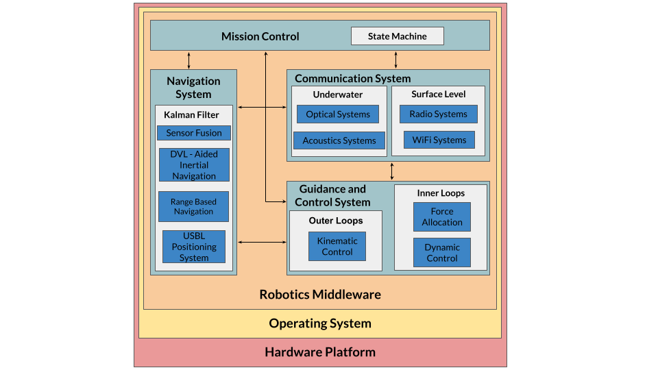

## FAROL Overview 

| Package/Metapackage   |      Description      |
|:---------------------:|:---------------------|
| 3rd_party            |  ROS packages and messages from the ROS community. |
| **farol_addons**         |  Handy material common to all the stack like libraries, parsers, alias and bash scripts |
| farol_behaviors      |  State machines for vehicle missions   |
| **farol_bringup**        |  Setup vehicle primitives and bringup architecture |
| **farol_comms**          |  Acoustic, radio, optical comms |
| **farol_control**        |  Inner and outer loops controllers. |
| **farol_msgs**           |  FAROL stack messages |
| **farol_nav**            |  Sensor fusion, navigation filter |
| **farol_planning**       |  Motion planning algorithms |
| **farol_sim**            |  Simple dynamic model and sensor simulation |

