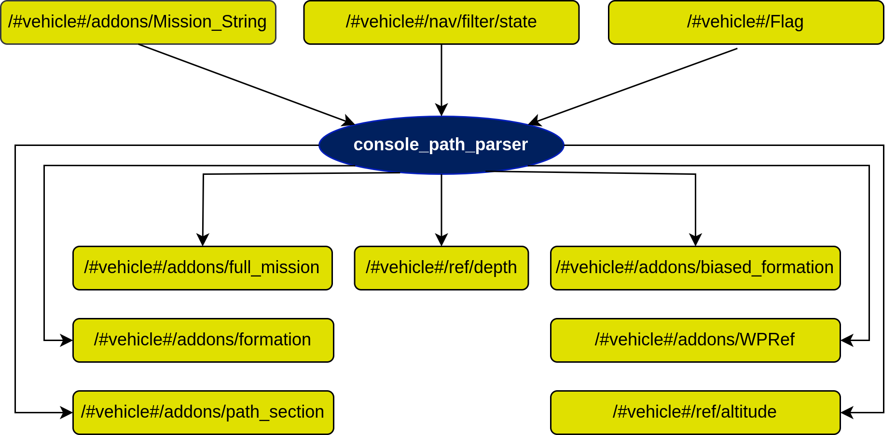

# console_path_parser Node

## In a nutshell
Parse a string mission from a web interface (PONTE) to dsor_paths node that will interact with path following algorithms. 

Note: The important action in this node is to call the services of [dsor_paths](https://dsor-isr.github.io/farol/dsor_paths/dsor_paths/) node to build the path of the mission and start the execution of the path following control via service. Since this is a legacy component of the stack please kindly ignore many of the Subscribers and Publishers because they are not being used at this stage of the stack.

## Diagram

## Subscribers
| Subscribers           | msgs type                                                                        | Purpose                      |
| -----------           | --------------                                                                   | ---------                    |
| /#vehicle#/State      | [farol_msgs/mState](https://dsor-isr.github.io/farol/farol-ros-messages/mState/) | State of the vehicle         |

## Publishers
Not being used

## Services

| Services                       | srv type                     | Purpose                                               |
| --------                       | --------                     | -------                                               |
| "/#vehicle#/ResetPath"         | [dsor_paths/ResetPath]()     | Reset the actual path to start a new one              |
| "/#vehicle#/SpawnArc2DPath"    | [dsor_paths/SpawnArc2D]()    | Add an arc section to the path                        |
| "/#vehicle#/SpawnLinePath"     | [dsor_paths/SpawnLine]()     | Add a line section to the path                        |
| "/#vehicle#/PFStart"           | [dsor_paths/StartPF]()       | Start path following controller                       |
| "/#vehicle#/PFStop"            | [dsor_paths/StopPF]()        | Stop path following controller                        |
| "/#vehicle#/SetConstVdVehicle" | [dsor_paths/SetConstSpeed]() | Set the desired velocity for each section of the path |

## Parameters
| Parameters                                        | type   | Default               | Purpose                                                   |
| ----------                                        | ----   | -------               | -------                                                   |
| /#vehicle#/addons/console_path_parser/path_folder | string | ../paths_from_console | Store the path received from http_server                  |
| /#vehicle#/addons/vehicle_id                      | int    | [1-3]                 | IDs of the medusas: 1 - mred, 2 - mblack, 3 - mvector     |

