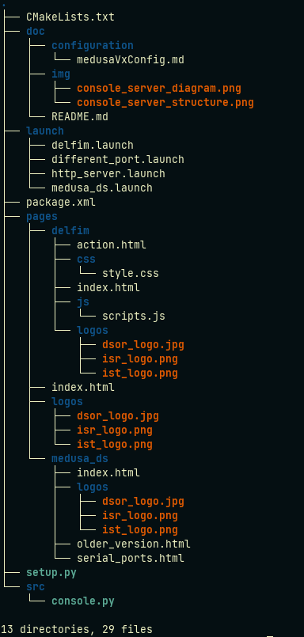

# http_server package

## In a nutshell
http_server is a ROS package written in Python responsible for managing the information between a web console (PONTE) and a marine vehicle/simulation environment.

## Diagram

## Publishers

* /#vehicle#/addons/Mission_String[[std_msgs/String](http://docs.ros.org/en/noetic/api/std_msgs/html/msg/String.html)] - String with desired path following mission  

## Subscribers
* /#vehcile#/sensors/* - Information from several sensors

## Services
* None

## Parameters
* /#vehicle#/addons/console_server/PORT - Default 7080
* /#vehicle#/addons/console_server/ROOT_NAMESPACE - True
* /#vehicle#/addons/console_server/pages_folder - Folder with individual pages of each vehicle
* /#vehicle#/addons/console_server/Mission_folder - Folder with stored txt files with path following missions.

## Package content 

## Rationale

A vehicle runs an http server and is responsible to send and read http requests. It also creates a simple html web page displaying relevant vehicle information.

**NOTE:** This package will be replaced with a solution using rosbridge and roslibjs.

## Requirements
* web console (Ponte)

