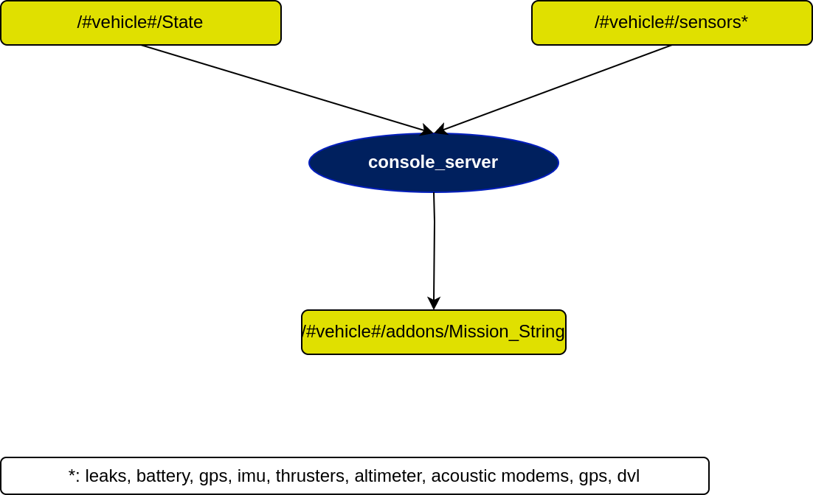

# http_server package

## In a nutshell
console_server is a ROS node written in Python with the main purpose of handling a string mission from the web interface PONTE.

## Diagram

## Subscribers
| Subscribers           | msgs type                                                                        | Purpose                      |
| -----------           | --------------                                                                   | ---------                    |
| /#vehicle#/sensors/\* | [std_msgs](http://docs.ros.org/en/api/std_msgs/html/index-msg.html)              | information from the sensors |
| /#vehicle#/State      | [farol_msgs/mState](https://dsor-isr.github.io/farol/farol-ros-messages/mState/) | State of the vehicle         |

## Publishers
| Publishers            | msgs type                                                                   | Purpose                                  |
| -----------           | --------------                                                              | ---------                                |
| /#vehicle#/sensors/\* | [std_msgs/String](http://docs.ros.org/en/api/std_msgs/html/msg/String.html) | Mission string to be done by the vehicle |

## Services
* None

## Parameters
| Parameters                                      | type   | Default | Purpose                                                   |
| ----------                                      | ----   | ------- | -------                                                   |
| /#vehicle#/addons/console_server/PORT           | int    | 7080    | TCP port                                                  |
| /#vehicle#/addons/console_server/ROOT_NAMESPACE | bool   | True    | Use private namespace                                     |
| /#vehicle#/addons/console_server/pages_folder   | string | ./      | Folder with vehicle webpages                              |
| /#vehicle#/addons/console_server/Mission_folter | string | -       | Folder with stored txt files with path following missions |
