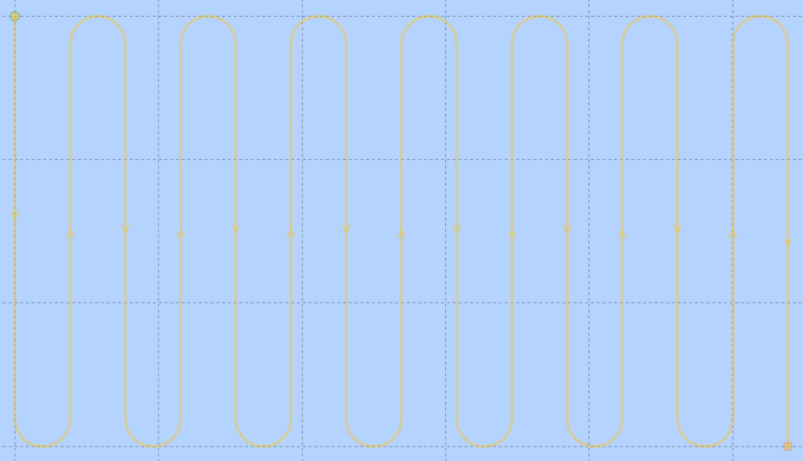
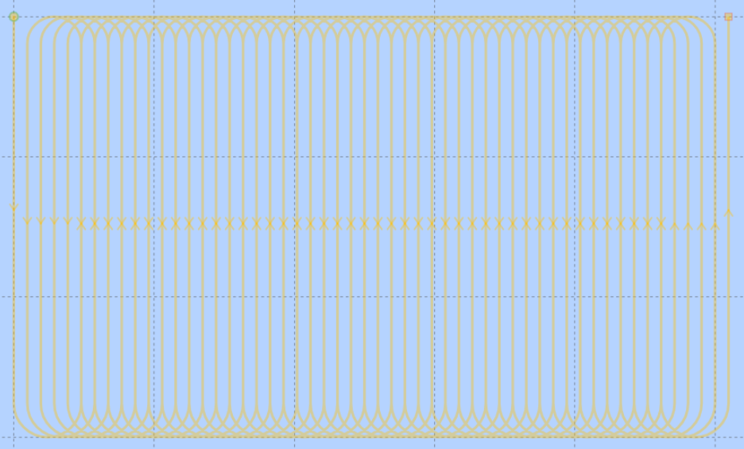

# Mission Planner Package

## Description

This package handles the creation of paths and start of PF missions along a zone of interest. Through a service, this area is defined by northing and easting limits, inside which a new path is created. It also implements a communication protocol between a surface vessel (master) and N underwater vehicles (those who are meant to participate on the Path Following mission).

This path can be a **normal** lawnmower or an **encircling** lawnmower, both fully customisable through the *config_mission_planner.yaml* file or through a service.

## Communication Protocol

The surface vessel starts by scanning for available underwater vehicles (AUVs) which are willing to participate in a PF mission inside an area of interest. Those willing to do so send back to the vessel a confirmation that they are ready to start the mission. After getting confirmation from a set of AUVs, the surface vessel can publish a zone of interest, which is then sent to the AUVs. These will then generate the mission string, start the PF and send back to the vessel an acknowledge message confirming the successful start of the mission, which indicates to the surface vessel to save a file in the home directory with the current mission.
In the case that any of the scanned AUVs doesn't acknowledge back the successful start of the mission (according to a configurable timeout parameter), then the surface vessel tells all AUVs to stop the PF (tells them to publish a flag 0).

## Nodes
* [mission_planner](mission_planner.md)