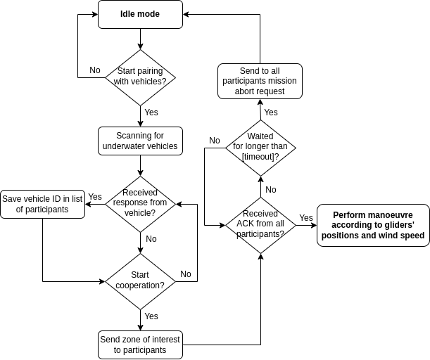
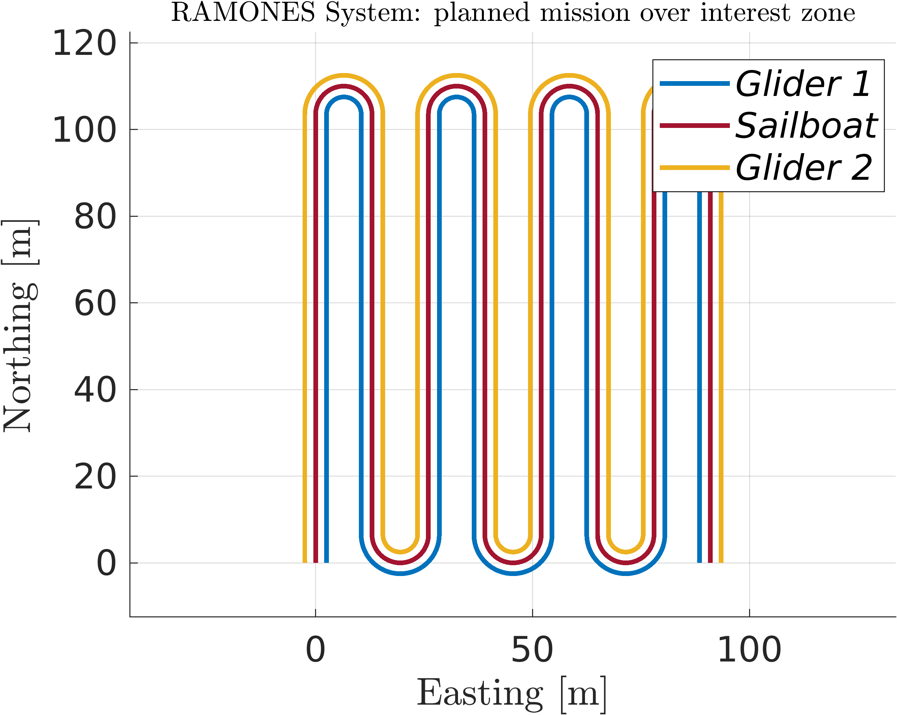
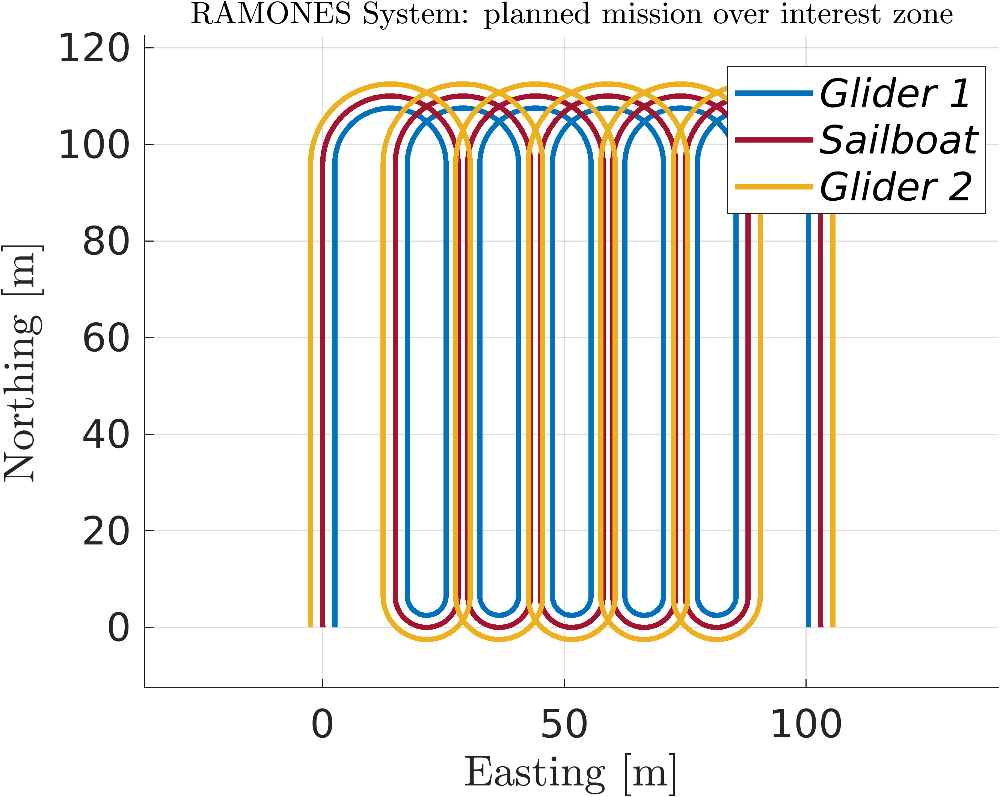

# Mission Planner Node

The mission planner package was created with the vision of accomplishing success in the RAMONES project. Having in mind the cooperation of an autonomous surface vehicle such ULPGC’s A-TIRMA sailboat and two underwater gliders, it is of pivotal importance that all vehicles are synchronised regarding how and when to communicate with each other acoustically. The following flowchart illustrates the adopted Acoustic Comms protocol.

  

The sailboat starts by sending a broadcast message acoustically, to which the available underwater gliders answer back, sending in the response message’s payload their own unique vehicle ID, which is in turn saved in a list of participating vehicles.

Subsequently, when all underwater vehicles intended to participate in the cooperative mission are successfully paired up with the sailboat, it sends them the zone of interest, characterised by minimum and maximum longitude and latitude values and a target depth.

If all participating vehicles acknowledge the new mission’s zone of interest, then the sailboat starts its own manoeuvre, in cooperation with the gliders - otherwise, it sends them a request to abort the mission.

## Types of missions

There are two available types of mission types: normal and encircling lawnmower.

  

  

## Subscribers

- "/#vehicle#/nav/filter/state" [auv_msgs/NavigationStatus]
- "/#vehicle#/mission_planner/interest_zone" [mission_planner/mInterestZone]
- "/#vehicle#/acomms/new_iz_mission" [mission_planner/mNewIZMission]
- "/#vehicle#/acomms/being_scanned" [std_msgs/Empty]
- "/#vehicle#/acomms/vehicle_ready" [std_msgs/Int8]
- "/#vehicle#/acomms/mission_started_ack" [mission_planner/mMissionStartedAck]
- "/#vehicle#/acomms/stop_pf" [std_msgs/Bool]
- "/#vehicle#/State_usbl_est_auv0" [farol_msgs/mState]
- "/#vehicle#/State_usbl_est_auv1" [farol_msgs/mState]

## Publishers

- "/#vehicle#/addons/Mission_String" [std_msgs/String]
- "/#vehicle#/mission_planner/mission_started_ack" [std_msgs/Int8]
- "/#vehicle#/mission_planner/new_iz_mission" [mission_planner/mNewIZMission]
- "/#vehicle#/mission_planner/ready_for_mission" [std_msgs/Int8]
- "/#vehicle#/mission_planner/stop_all_pf" [std_msgs/Empty]
- "/#vehicle#/Flag" [std_msgs/Int8]
- "/#vehicle#/mission_planner/asv_waypoints" [std_msgs/Float64MultiArray]
- "/#vehicle#/ref/depth" [std_msgs/Float64]

## Services

- /#vehicle#/mission_planner/change_configurations [mission_planner/Configs]
- /#vehicle#/mission_planner/interest_zone [mission_planner/InterestZone]

## Parameters

Under the namespace *mission_planner/*:
| Parameters  | type | Default    | Purpose |
| ----------- | ---- | ---------- | ------- |
| path_post_rotation | double | 0.0 | degrees to rotate the path after it's been generated (e.g. to accomodate for wind direction) |
| path_orientation | int | 1 | 0 - EAST/WEST, 1 - NORTH/SOUTH |
| path_type | string | "lawnmower_normal" | lawnmower_normal, lawnmower_encircling |
| min_turning_radius | double | 50.0 | |
| path_speed | double | 0.7 | |
| resolution | double | 10.0 | if path_type = lawnmower_encircling, resolution is the distance between the lawnmower's legs |
| dist_inter_vehicles | double | 15.0 | distance between paths when multiple paths are generated, for CPF |
| timeout_ack | double | 120.0 | time to wait without no ack from participating vehicles |
| vehicle_id | int | 2 | |
| send_waypoints_auvs_following | bool | false | set to true to generate waypoints using ist_ros (CANARIAS) interface to follow two auvs (gliders) |
| waypoints_update_interval | double | 360.0 | only needed for asv measuring 2 auvs (if send_waypoints_auvs_following=true) |
| wp_distance_along | double | 40.0 | metres away from gliders average point along track (if send_waypoints_auvs_following=true) |
| wp_distance_cross | double | 15.0 | metres away from gliders average point cross track (if send_waypoints_auvs_following=true) |
| wp_offset_along | double | 0.0 | offset from gliders average point (if send_waypoints_auvs_following=true) |
| wp_offset_cross | double | 10.0 | offset from gliders average point (if send_waypoints_auvs_following=true) |
