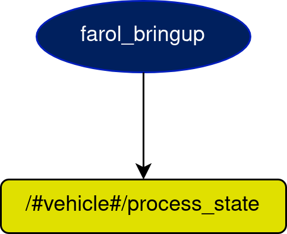

# farol_bringup Node

## In a nutshell
This node is launched by the custom bringup and subsequently launches the whole system, using the default configurations inside the package `farol_bringup`, and later loading the new configurations to specifically override certain already launched variables.

## Diagram

## Subscribers
* None

## Publishers
| Publishers               | msgs type                                                                                    | Purpose                                    |
| -----------              | --------------                                                                               | ---------                                  |
| /#vehicle#/process_state/ | [farol_msgs/ProcessState](https://dsor-isr.github.io/farol/farol-ros-messages/ProcessState/) | What process is being launched at the time |

## Services
| Services                   | msgs type                                                                                      | Purpose                                           |
| -----------                | --------------                                                                                 | ---------                                         |
| /#vehicle#/manage_process/ | [farol_msgs/ManageProcess](https://dsor-isr.github.io/farol/farol-ros-messages/ManageProcess/) | Manually manage processes that are being launched |

## Parameters
| Parameters                                          | type   | Default                              | Purpose                                                                                  |
| ----------                                          | ----   | -------                              | -------                                                                                  |
| /#vehicle#/farol_bringup/config_package_path        | string | find <your_bringup_name>\_bringup    | This parameter is used to find your bringup in order to launch everything that is needed |
| /#vehicle#/farol_bringup/folder                     | string | vehicles                             | `vehicles` folder                                                                        |
| /#vehicle#/farol_bringup/name                       | string | <vehicle_name_argument>              | `name` argument specified while calling the `roslaunch` command                          |
| /#vehicle#/farol_bringup/namespace                  | bool   | true                                 | Specify if there is a vehicle namespace in the topics                                    |
| /#vehicle#/farol_bringup/process_state_publish_rate | float  | 0.33                                 | Specify the rate at which the processes in the bringup are being published               |
| /#vehicle#/farol_bringup/processes                  | string | process.yaml                         | Specify the processes to launch                                                          |
| /#vehicle#/farol_bringup/vehicle_id                 | int    | <vehicle_id_argument>                | `id` argument specified while calling the `roslaunch` command                            |
