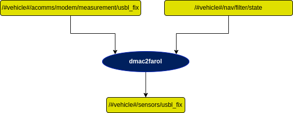

# dmac2farol Node

This package serves as an interface between the *dmac* driver node (connects via TCP to the EvoLogics' modem's ethernet communication interface and parses its output to ROS topics) and the *usblfix2pos* node (computes a target's inertial position based on the inertial bearing and elevation of the target relative to the USBL, the range to the target and the USBL's inertial position).

  

The *usblfix2pos* node always expects bearing and elevation angles expressed in the inertial frame, while the former can't guarantee it, since it depends on the inner characteristics of the EvoLogics USBL hardware (in practice, if it has a built-in AHRS or not).

## USBL has an AHRS: 

**If the USBL has an AHRS**, it outputs the bearing and elevation angles both in local $\{USBL\}$ frame and in inertial frame $\{I\}$. As such, the *dmac* driver will output these angles in inertial frame, provided that the *hasAHRS* flag is set to **true** in the *comms.yaml* configuration file (see *dmac* documentation for further explanation) - so the *real* parameter should be set to **false**.

## USBL **DOES NOT** have an AHRS:

**If the USBL does not have an AHRS**, the bearing and elevation angles are output in the local $\{USBL\}$ frame ($\beta_{USBL}$ and $\epsilon_{USBL}$ respectively), so they need to be rotated to the inertial frame $\{I\}$  - so the *real* parameter should be set to **true**.

In this case, the dmac2farol node starts by calculating a unit vector $\bold{v}_{USBL}$ that is pointing to the target, using $\beta_{USBL}$ and $\epsilon_{USBL}$, expressed in the USBL frame:

$$ \bold{v}_{USBL} = 
\begin{bmatrix}
\cos{(\beta_{USBL})} \cos{(\epsilon_{USBL})}\\
\sin{(\beta_{USBL})} \cos{(\epsilon_{USBL})}\\
\sin{(\epsilon_{USBL})}
\end{bmatrix}. $$

Then, this unit vector is rotated from USBL to body frame and then from body to inertial frame, creating a new unit vector $\bold{v}_{I}$ expressed in the inertial frame:

$$ \bold{v}_{I} = {\,} _B^I R(\phi_B, \theta_B, \psi_B) {\,} . {\,} _{USBL}^B R(\phi_{USBL}, \theta_{USBL}, \psi_{USBL}) {\,} . {\,} \bold{v}_{USBL} =
\begin{bmatrix}
{v_{I}}_1\\
{v_{I}}_2\\
{v_{I}}_3
\end{bmatrix}, $$

where $_B^I R(\phi_B, \theta_B, \psi_B)$ is the rotation matrix from body frame to inertial frame, ($\phi_B, \theta_B, \psi_B$) are the roll, pitch and yaw angles of the body with respect to the inertial frame, $_{USBL}^B R(\phi_{USBL}, \theta_{USBL}, \psi_{USBL})$ is the installation matrix, i.e., the rotation matrix from USBL frame to body frame and ($\phi_{USBL}, \theta_{USBL}, \psi_{USBL}$) are the roll, pitch and yaw angles of the USBL with respect to the body frame.

Finally, this unit vector is converted back to bearing ($\beta_I$) and elevation ($\epsilon_I$) angles, in the inertial frame:

$$ \beta_I = \tan^{-1}\left(\dfrac{{v_{I}}_2}{{v_{I}}_1}\right) {\quad} \epsilon_I = \tan^{-1}\left(\dfrac{{v_{I}}_3}{\sqrt{({v_{I}}_1)^2 + ({v_{I}}_2)^2}}\right). $$

### **Rotation Matrices, Angles and Frames**

An important note on rotation angles is the adopted **convention**.

Let $(\phi, \theta, \psi)$ - roll, pitch and yaw, respectively - be the rotation angles from frame $\{I\}$ to frame $\{B\}$, assuming a sequence of rotations in the current frame by the following order: yaw first, then pitch, roll last (Z-Y-X). Then, the rotation matrix from $\{B\}$ to $\{I\}$ is

$$ _B^I R(\phi, \theta, \psi) = R(\psi) \, . \, R(\theta) \, . \, R(\phi) = \\
\text{} \\
= \begin{bmatrix}
c{(\psi)} & -s{(\psi)} & 0 \\
s{(\psi)} & c{(\psi)} & 0 \\
0 & 0 & 1 \\
\end{bmatrix} \, . \, 
\begin{bmatrix}
c{(\theta)} & 0 & s{(\theta)} \\
0 & 1 & 0 \\
-s{(\theta)} & 0 & c{(\theta)} \\
\end{bmatrix} \, . \,
\begin{bmatrix}
1 & 0 & 0 \\
0 & c{(\phi)} & -s{(\phi)} \\
0 & s{(\phi)} & c{(\phi)} \\
\end{bmatrix} = \\
\text{} \\
= \begin{bmatrix}
c{(\psi)}c{(\theta)} &
  c{(\psi)}s{(\theta)}s{(\phi)} - s{(\psi)}c{(\phi)} &
  c{(\psi)}s{(\theta)}c{(\phi)} + s{(\psi)}s{(\phi)} \\
s{(\psi)}c{(\theta)} & 
  s{(\psi)}s{(\theta)}s{(\phi)} + c{(\psi)}c{(\phi)} &
  s{(\psi)}s{(\theta)}c{(\phi)} - c{(\psi)}s{(\phi)}\\
-s{(\theta)}& 
  c{(\theta)}s{(\phi)}& 
  c{(\theta)}c{(\phi)}\\
\end{bmatrix} ,$$

where $c{(.)}$ and $s{(.)}$ are the cosine and sine functions, respectively. The angles specified in the *installation_matrix* parameter follow this convention.

**EvoLogics $\{USBL\}$ frame**

According to EvoLogics documentation, the adopted frame for their USBL is pictured below.

  

**Installation matrix examples:**

- <ins>Medusa Yellow</ins>

In Medusa Yellow's case, in order to obtain the $\{USBL\}$ frame, starting from the $\{B\}$ frame, a single rotation of $-45º$ in yaw is needed, as seen in the figure below.

  

So, the *installation matrix* parameters are $[0, 0, - \dfrac{\pi}{4}]$.

- <ins>Medusa Black</ins>

In Medusa Black's case, in order to obtain the $\{USBL\}$ frame, starting from the $\{B\}$ frame, a rotation of $45º$ in yaw is required, followed by a rotation of $180º$ in roll, as seen in the figure below.

  

As such, the *installation matrix* parameters are $[\pi, 0, \dfrac{\pi}{4}]$.

## Diagram

  

## Subscribers

## Publishers

## Services

## Parameters

| Parameters | Type | Default | Purpose |
| --- | --- | --- | --- |
| fix_type 
[DEPRECATED]
 | bool | false | **False**: vehicle acts as an anchor, calculates other vehicles' position. **True**: vehicle calculates its own position. |
| real | bool | false | **False**: Bearing and elevation angles from dmac driver are in inertial frame (since USBL has internal AHRS). This is the case in simulation, when using EvoLogics emulators.  **True**: Bearing and elevation angles from dmac driver are in local frame (USBL does not have AHRS), so they need to be rotated from local/usbl frame to inertial frame. |
| installation\_matrix | float[] | - | Array of 3 angles, [Roll, Pitch, Yaw], in radians. These angles correspond to the rotation from Body to USBL frame (check documentation above). |