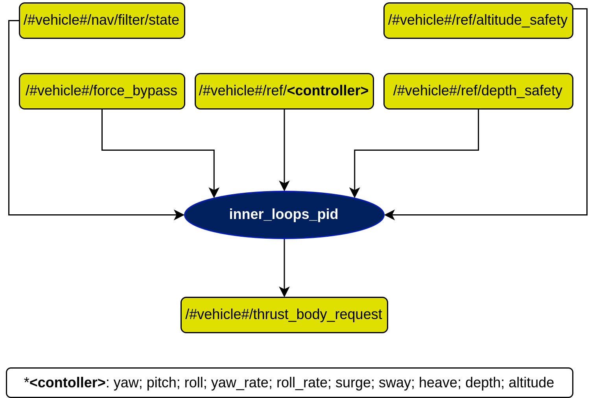

# inner\_loops\_pid Node

## In a nutshell
This node launches the inner loop of the vehicle, where the realization is made using PID controllers. It outputs the thrust necessary for the thrusters of the vehicle. For indepth documentation, refer the links below:

* [Theory](./theory.md)

## Diagram

## Subscribers
| Subscribers | msgs type | Purpose |
| ---         | ---       | ---     |
| /#vehicle#/nav/filter/state | [auv\_msgs/NavigationStatus](https://github.com/oceansystemslab/auv_msgs/blob/1faaddd7ee6e9c2c9869e3d8dcff92bb56c2fce4/msg/NavigationStatus.msg) | Filtered vehicle state |
| /#vehicle#/force\_bypass | [auv\_msgs/BodyForceRequest](https://github.com/oceansystemslab/auv_msgs/blob/1faaddd7ee6e9c2c9869e3d8dcff92bb56c2fce4/msg/BodyForceRequest.msg) | Forces from external controllers to be also considered in the PID controllers |
| /#vehicle#/ref/altitude\_safety | [std\_msgs/Float64](http://docs.ros.org/en/api/std_msgs/html/msg/Float64.html) | Reference for minimum safe altitude |
| /#vehicle#/ref/depth\_safety | [std\_msgs/Float64](http://docs.ros.org/en/api/std_msgs/html/msg/Float64.html) | Reference for maximum safe depth |
| /#vehicle#/ref/`<controller>` | [std\_msgs/Float64](http://docs.ros.org/en/api/std_msgs/html/msg/Float64.html) | References for PID controllers to follow |

where, just like in the diagram, `<controller>` can be one of the following:

| Angles | Angle Rates | Speeds | Position |
| ---    | ---    | ---    | ---    |
| yaw | yaw\_rate | surge | depth |
| roll | roll\_rate | sway | altitude |
| pitch | - | heave | - |

## Publishers
| Publishers | msg type | Purpose |
| --- | --- | --- |
| /#vehicle#/thrust\_body\_request | [auv\_msgs/BodyForceRequest](https://github.com/oceansystemslab/auv_msgs/blob/1faaddd7ee6e9c2c9869e3d8dcff92bb56c2fce4/msg/BodyForceRequest.msg) | Calculated forces to be applied on the thrusters |

## Services
| Services | srv type | Purpose |
| --- | --- | --- |
| /#vehicle#/inner\_forces/change\_ff\_gains | [inner\_loops\_pid/ChangeFFGains](https://github.com/dsor-isr/farol/blob/main/farol_control/inner_loops_controllers/inner_loops_pid/srv/ChangeFFGains.srv) | Change feedforward gains |
| /#vehicle#/inner\_forces/change\_inner\_gains | [inner\_loops\_pid/ChangeInnerGains](https://github.com/dsor-isr/farol/blob/main/farol_control/inner_loops_controllers/inner_loops_pid/srv/ChangeInnerGains.srv) | Change the gains one of the PID controllers |
| /#vehicle#/inner\_forces/change\_inner\_limits | [inner\_loops\_pid/ChangeInnerLimits](https://github.com/dsor-isr/farol/blob/main/farol_control/inner_loops_controllers/inner_loops_pid/srv/ChangeInnerLimits.srv) | Change the output limits of one of the PID controllers |

## Parameters
All the parameters are under the namespace of this node (/#vehicle#/controls/inner\_loops\_pid/), so we will refrain from repeating it for each parameter. Visit the [`control.yaml`](https://github.com/dsor-isr/farol/blob/main/farol_bringup/config/defaults/myellow/control.yaml) config file for each vehicle to check these parameters.

### Altitude Controller
| Parameters | type | Default | Purpose |
| --- | --- | --- | --- |
| /controllers/altitude/kd | float | - | Altitude controller derivative gain |
| /controllers/altitude/ki | float | - | Altitude controller integral gain |
| /controllers/altitude/kp | float | - | Altitude controller proportional gain |
| /controllers/altitude/max\_depth | float | - | Maximum depth for altitude controller |
| /controllers/altitude/max\_err | float | - | Maximum error for altitude controller input |
| /controllers/altitude/max\_out | float | - | Maximum output for altitude controller |
| /controllers/altitude/min\_err | float | - | Minimum error for altitude controller |
| /controllers/altitude/min\_out | float | - | Minimum output for altitude controller |

### Depth Controller
| Parameters | type | Default | Purpose |
| --- | --- | --- | --- |
| /controllers/depth/kd | float | - | Deth controller derivative gain |
| /controllers/depth/ki | float | - | Depth controller for integral gain |
| /controllers/depth/kp | float | - | Depth controller for proportional gain |
| /controllers/depth/max\_err | float | - | Maximum error for depth controller input |
| /controllers/depth/max\_out | float | - | Maximum output for depth controller |
| /controllers/depth/min\_alt | float | - | Maximum altitude for depth controller |
| /controllers/depth/min\_err | float | - | Minimum error for depth controller |
| /controllers/depth/min\_out | float | - | Minimum output for depth controller |

### Surge Controller
| Parameters | type | Default | Purpose |
| --- | --- | --- | --- |
| /controllers/surge/ki | float | - | Surge controller integral gain |
| /controllers/surge/kp | float | - | Surge controller proportional gain |
| /controllers/surge/max\_err | float | - | Maximum error for surge controller input |
| /controllers/surge/max\_out | float | - | Maximum output for surge controller |
| /controllers/surge/max\_ref | float | - | Maximum reference for surge controller |
| /controllers/surge/min\_err | float | - | Minimum error for surge controller |
| /controllers/surge/min\_out | float | - | Minimum output for surge controller |
| /controllers/surge/min\_ref | float | - | Minimum reference for surge controller |

### Sway Controller
| Parameters | type | Default | Purpose |
| --- | --- | --- | --- |
| /controllers/sway/ki | float | - | Sway controller integral gain |
| /controllers/sway/kp | float | - | Sway controller proportional gain |
| /controllers/sway/max\_err | float | - | Maximum error for sway controller input |
| /controllers/sway/max\_out | float | - | Maximum output for sway controller |
| /controllers/sway/max\_ref | float | - | Maximum reference for sway controller |
| /controllers/sway/min\_err | float | - | Minimum error for sway controller input |
| /controllers/sway/min\_out | float | - | Minimum output for sway controller |
| /controllers/sway/min\_ref | float | - | Minimum reference for sway controller |

### Yaw Controller
| Parameters | type | Default | Purpose |
| --- | --- | --- | --- |
| /controllers/yaw/kd | float | - | Yaw controller derivative gain |
| /controllers/yaw/ki | float | - | Yaw controller integral gain |
| /controllers/yaw/kp | float | - | Yaw controller proportional gain |
| /controllers/yaw/max\_err | float | - | Maximum error for yaw controller input |
| /controllers/yaw/max\_out | float | - | Maximum output for yaw controller |
| /controllers/yaw/min\_err | float | - | Minimum error for yaw controller input |
| /controllers/yaw/min\_out | float | - | Minimum output for yaw controller |

### Yaw Rate Controller
| Parameters | type | Default | Purpose |
| --- | --- | --- | --- |
| /controllers/yaw\_rate/ki | float | - | Yaw rate integral gain |
| /controllers/yaw\_rate/kp | float | - | Yaw rate proportional gain |
| /controllers/yaw\_rate/max\_err | float | - | Maximum error for yaw rate controller input |
| /controllers/yaw\_rate/max\_out | float | - | Maximum output for yaw rate controller |
| /controllers/yaw\_rate/min\_err | float | - | Minimum error for yaw rate controller input |
| /controllers/yaw\_rate/min\_out | float | - | Minimum output for yaw rate controller |

### General Parameters
| Parameters | type | Default | Purpose |
| --- | --- | --- | --- |
| /forces\_hard\_bypass | bool | false | If hard bypass is `true`, the controller completely ignores the yaw PID forces and reads from an external source, otherwise it sums all the force components |
| /min\_alt | float | - | Minimum altitude for overall controller |
| /node\_frequency | float | - | Working frequency of the node |
| /timout\_ref | float | - | Timeout for hard bypass reference use (stops using external forces after this time) |