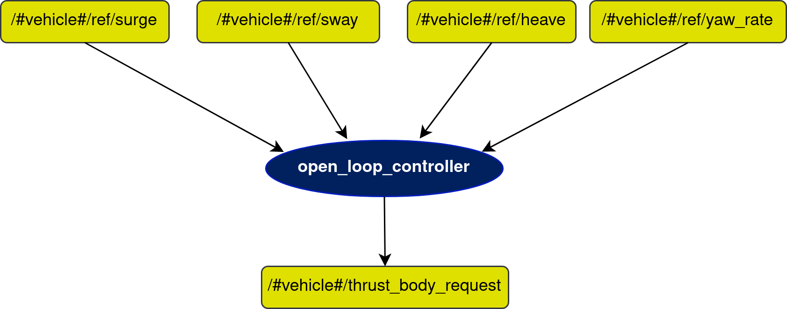

# open_loop_controller

## In a nutshell
The open_loop_controller node is, like it suggests, can be used as an alternative to the typical PID controllers implemented on the vehicles, depending only on the current input reference values.

## Diagram

## Subscribers
| Subscribers | msg type | Purpose |
| --- | --- | --- |
| /#vehicle#/ref/surge | [std_msgs/Float64](http://docs.ros.org/en/api/std_msgs/html/msg/Float64.html) | Surge reference for vehicle to follow |
| /#vehicle#/ref/sway | [std_msgs/Float64](http://docs.ros.org/en/api/std_msgs/html/msg/Float64.html) | Sway reference for vehicle to follow |
| /#vehicle#/ref/heave | [std_msgs/Float64](http://docs.ros.org/en/api/std_msgs/html/msg/Float64.html) | Heave reference for vehicle to follow |
| /#vehicle#/ref/yaw_rate | [std_msgs/Float64](http://docs.ros.org/en/api/std_msgs/html/msg/Float64.html) | Yaw rate for vehicle to follow |

## Publishers
| Publishers | msg type | Purpose |
| --- | --- | --- |
| /#vehicle#/thrust_body_request | [auv_msgs/BodyForceRequest](https://github.com/oceansystemslab/auv_msgs/blob/1faaddd7ee6e9c2c9869e3d8dcff92bb56c2fce4/msg/BodyForceRequest.msg) | Forces requested by the controller to the thrusters |

## Parameters
| Parameters | type | Default | Purpose |
| --- | --- | --- | --- |
| /#vehicle#/controls/open_loop_controller/gain_Fx | float | - | Gain for the force component in x |
| /#vehicle#/controls/open_loop_controller/gain_Fy | float | - | Gain for the force component in y |
| /#vehicle#/controls/open_loop_controller/gain_Fz | float | - | Gain for the force component in z |
| /#vehicle#/controls/open_loop_controller/gain_Tz | float | - | Gain for the torque component in z |
| /#vehicle#/controls/open_loop_controller/node_frequency | float | 10 | Working frequency of the node |