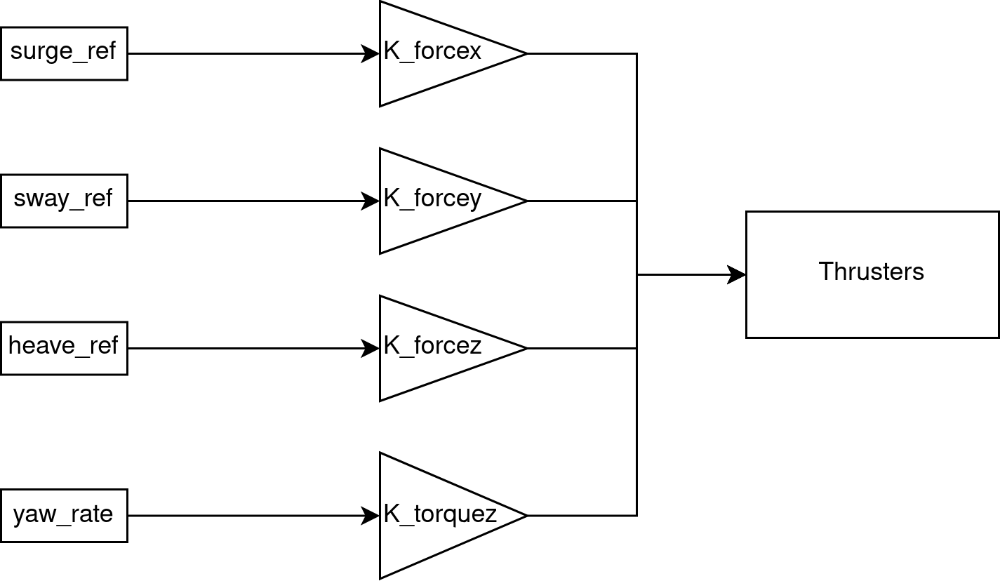

# Open Loop Theory
The open loop controller has a simpler architecture than the PID controller. It accepts the reference values as inputs, and through gains calculates the desired output forces to be requested to the thrusters. A schematic of the system is presented below:

