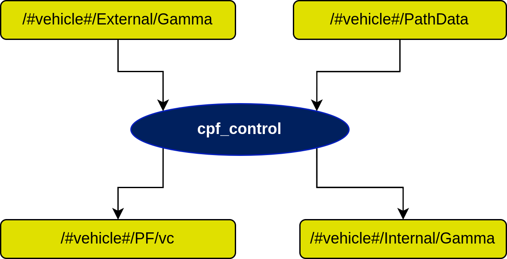

# cpf_control Node

## In a nutshell
This node adds a cooperative layer to an already set PF algorithm. The communications are managed within the scope of farol_comms, in [cpf_gamma](https://dsor-isr.github.io/farol/cpf-gamma/) for a standard WiFi connection.

## Diagram

## Subscribers
| Subscribers | msg type | Purpose |
| --- | --- | --- |
| /#vehicle#/External/Gamma | [farol\_msgs/CPFGamma](http://docs.ros.org/en/api/std_msgs/html/msg/Float64.html) | Gamma from other vehicles coming from the CPF server |
| /#vehicle#/PathData | [dsor\_paths/PathData](https://dsor-isr.github.io/farol/dsor-paths/PathData/) | Path variables given by a certain gamma related vehicle state |

## Publishers
| Publishers | msg type | Purpose |
| --- | --- | --- |
| /#vehicle#/PF/vc | [std\_msgs/Float64](http://docs.ros.org/en/api/std_msgs/html/msg/Float64.html) | Velocity correction calculated by the CPF algorithm |
| /#vehicle#/Internal/Gamma | [farol\_msgs/CPFGamma](https://dsor-isr.github.io/farol/farol-ros-messages/CPFGamma/) | Gamma from current vehicle to be disseminated by the CPF client |

## Services
| Services | msg type | Purpose |
| --- | --- | --- |
| /#vehicle#/CPFStart | [cpf\_control/StartStop](StartStop.md) | Start the CPF service |
| /#vehicle#/CPFStop | [cpf\_control/StartStop](StartStop.md) | Stop the CPF service |
| /#vehicle#/CPFChangeTopology | [cpf\_control/ChangeTopology](ChangeTopology.md) | Change the topology of the CPF network |

## Parameters

### General Parameters
| Parameters | type | Default | Purpose |
| --- | --- | --- | --- |
| node\_frequency | float | 10.0 | Working frequency of the node |
| ID | int | 2 | Vehicle ID inside the cooperative network |
| adjacency\_matrix | array | [0, 1, 1, 1,   1, 0, 1, 1,   1, 1, 0, 1,   1, 1, 1, 0] | Matrix used to describe the links between vehicles in the same cooperative network |

### Event-Triggered Communications Gains
| Parameters | type | Default |
| --- | --- | --- |
| c0 | float | 0.001 |
| c1 | float | 5.0 |
| alpha | float | 1.0 |
| k\_epsilon | float | 1.0 |