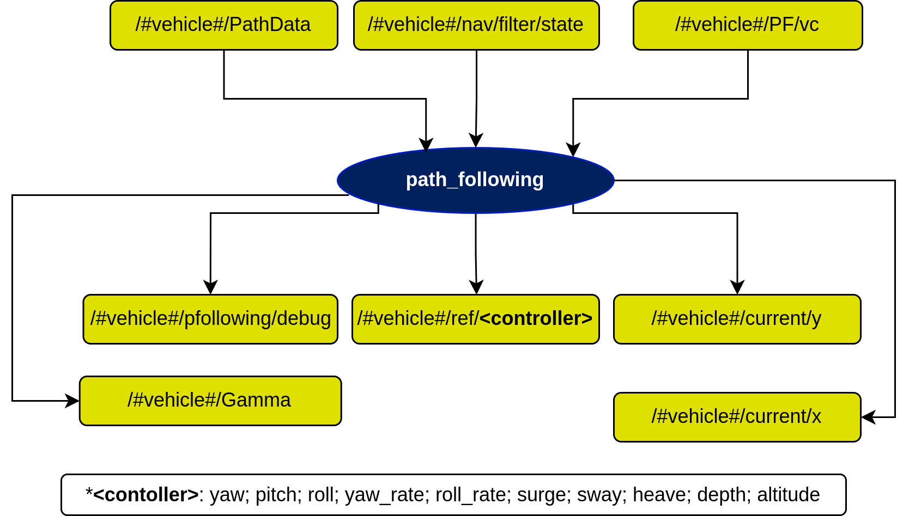

# path\_following Node

## In a nutshell
This node manages the PF properties discussed in the [implementation](implementation.md) section.

## Diagram

## Subscribers
| Subscribers | msg type | Purpose |
| --- | --- | --- |
| /#vehicle#/nav/filter/state | [auv\_msgs/NavigationStatus](https://github.com/oceansystemslab/auv_msgs/blob/1faaddd7ee6e9c2c9869e3d8dcff92bb56c2fce4/msg/NavigationStatus.msg) | Filtered state of the vehicle |
| /#vehicle#/PathData | [dsor\_paths/PathData](https://dsor-isr.github.io/farol/dsor-paths/PathData/) | Path information sent from the path managing node |
| /#vehicle#/PF/vc | [std\_msgs/Float64](http://docs.ros.org/en/api/std_msgs/html/msg/Float64.html) | Velocity correction sent from the CPF node (if deployed) |
| /#vehicle#/Flag | [std\_msgs/Int8](http://docs.ros.org/en/api/std_msgs/html/msg/Int8.html) | Flag that determines teh state of the vehicle (idle, following waypoint, path, etc.) |

## Publishers
| Publishers | msg type | Purpose |
| --- | --- | --- |
| /#vehicle#/Gamma | [std\_msgs/Float64](http://docs.ros.org/en/api/std_msgs/html/msg/Float64.html) | Vehicle progression relative to the path parameter |
| /#vehicle#/pfollowing/debug | [farol\_msgs/mPFollowingDebug](https://dsor-isr.github.io/farol/farol-ros-messages/mPFollowingDebug/) | Topic used for debugging purposes only |
| /#vehicle#/current/x | [std\_msgs/Float64](http://docs.ros.org/en/api/std_msgs/html/msg/Float64.html) | Observe x current component |
| /#vehicle#/current/y | [std\_msgs/Float64](http://docs.ros.org/en/api/std_msgs/html/msg/Float64.html) | Observe y current component |
| /#vehicle#/ref/`<controller>` | [std\_msgs/Float64](http://docs.ros.org/en/api/std_msgs/html/msg/Float64.html) | References to be given to the inner loops |

## Services
| Services | msg type | Purpose |
| --- | --- | --- |
| /#vehicle#/PFStart | [path\_following/StartPF](StartPF.md) | Run the previously established path following |
| /#vehicle#/PFStop | [path\_following/StopPF](StopPF.md) | Stop the current PF mission |
| /#vehicle#/PFUpdateGains | [path\_following/UpdateGainsPF](UpdateGainsPF.md) | Update PF gains in real time |
| /#vehicle#/ResetVT | [path\_following/ResetVT](ResetVT.md) | Reset virtual target of current mission |
| /#vehicle#/PFSetRelativeHeading | [path\_following/SetPF](SetPF.md) | Set the desired PF algorithm to Relative Heading |
| /#vehicle#/PFSetMarcelo | [path\_following/SetPF](SetPF.md) | Set the desired PF algorithm to Marcelo |
| /#vehicle#/PFSetAguiar | [path\_following/SetPF](SetPF.md) | Set the desired PF algorithm to Aguiar |
| /#vehicle#/PFSetBrevik | [path\_following/SetPF](SetPF.md) |Set the desired PF algorithm to Brevik |
| /#vehicle#/PFSetFossen | [path\_following/SetPF](SetPF.md) | Set the desired PF algorithm to Fossen |
| /#vehicle#/PFSetRomulo | [path\_following/SetPF](SetPF.md) | Set the desired PF algorithm to Romulo |
| /#vehicle#/PFSetLapierre | [path\_following/SetPF](SetPF.md) | Set the desired PF algorithm to Lapierre |
| /#vehicle#/PFSetPramod | [path\_following/SetPF](SetPF.md) | Set the desired PF algorithm to Pramod |
| /#vehicle#/PFSetSamson | [path\_following/SetPF](SetPF.md) | Set the desired PF algorithm to Samson |
| /#vehicle#/ResetPath | [dsor_paths/ResetPath](https://dsor-isr.github.io/farol/dsor-paths/ResetPath/) | Resets the current path |
| /#vehicle#/SetMode | [dsor_paths/SetMode](https://dsor-isr.github.io/farol/dsor-paths/SetMode/) | Set if mode of operation calculates closest point to the path or if it receives an external gamma for path progression |
| /#vehicle#/controls/send\_wp\_standard | [waypoint/sendWpType1](https://dsor-isr.github.io/farol/waypoint/sendWpType1/) | Send a waypoint, especially used at end of the PF algorithm |

## Parameters

### Lapierre Algorithm
| Parameters | type | Default |
| --- | --- | --- |
| k1 | float | 1.0 |
| k2 | float | 0.3 |
| k3 | float | 0.3 |
| theta | float | 0.8 |
| k\_delta | float | 1.0 |

### Marcelo Algorithm
| Parameters | type | Default |
| --- | --- | --- |
| delta | float | -1.0 |
| kx | float | 0.5 |
| ky | float | 0.5 |
| kz | float | 0.5 |
| k\_pos | float | 2.0 |
| k\_currents | float | 0.2 |
| rd | array | [0.0, 0.0, 1.0] |
| d | array | [0.0, 0.0, 0.0] |

### Aguiar Algorithm
| Parameters | type | Default |
| --- | --- | --- |
| delta | float | -1.0 |
| kx | float | 0.5 |
| ky | float | 0.5 |
| kz | float | 0.5 |
| k\_pos | float | 0.5 |
| k\_currents | float | 0.5 |

### Romulo Algorithm
| Parameters | type | Default |
| --- | --- | --- |
| ke | array | [0.05, 0.0, 0.0, 0.05] |
| kz | float | 0.2 |

### Pramod Algorithm
| Parameters | type | Default |
| --- | --- | --- |
| kp | float | 0.01 |
| kd | float | 0.14 |

### Samson Algorithm
| Parameters | type | Default |
| --- | --- | --- |
| k1 | float | 1.0 |
| k2 | float | 0.3 |
| k3 | float | 0.3 |
| theta | float | 0.8 |
| k\_delta | float | 1.0 |

### Relative Heading Algorithm
| Parameters | type | Default |
| --- | --- | --- |
| kx | float | 0.5 |
| ky | float | 0.1 |
| kz | float | 0.2 |
| yaw\_offset | float | 0.785 |
| p\_sat | array | [1.0, 1.0] |

### General Parameters
| Parameters | type | Default | Purpose |
| --- | --- | --- | --- |
| node\_frequency | float | 10.0 | Working frequency of the node |