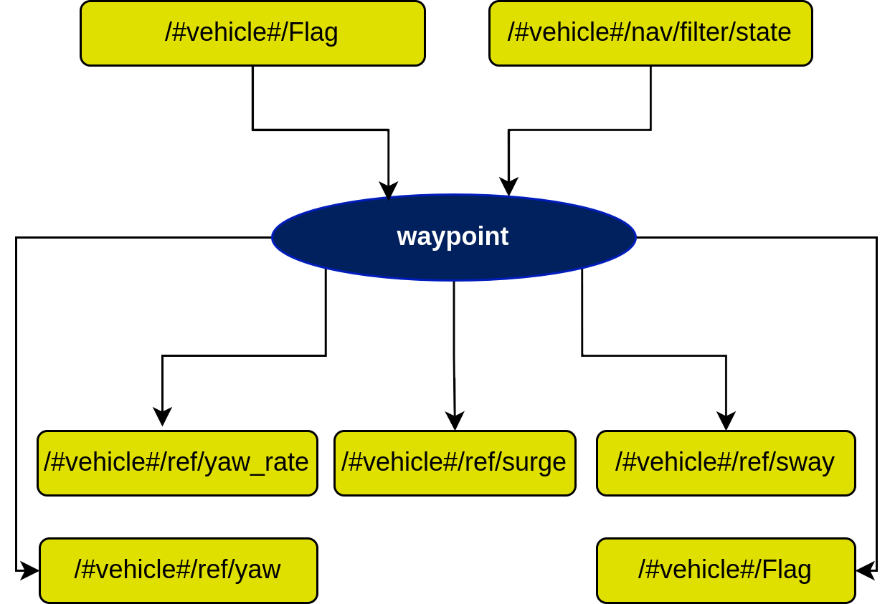

# waypoint node

## In a nutshell
The waypoint node takes in the filtered state of the vehicle, as well as the *Flag* topic (see [here](README.md) for more information). It calculates and outputs the desired references to make the vehicle converge to the specified waypoint.

## Diagram

## Subscribers
| Subscribers | msg type | Purpose |
| --- | --- | --- |
| /#vehicle#/Flag | [std_msgs/Int8](http://docs.ros.org/en/api/std_msgs/html/msg/Int8.html) | Flag that determines teh state of the vehicle (idle, following waypoint, path, etc.) |
| /#vehicle#/nav/filter/state | [auv_msgs/NavigationStatus](https://github.com/oceansystemslab/auv_msgs/blob/1faaddd7ee6e9c2c9869e3d8dcff92bb56c2fce4/msg/NavigationStatus.msg) | Filtered state of the vehicle |

## Publishers
| Publishers | msg type | Purpose |
| --- | --- | --- |
| /#vehicle#/ref/surge | [std_msgs/Float64](http://docs.ros.org/en/api/std_msgs/html/msg/Float64.html) | Surge reference for vehicle to follow |
| /#vehicle#/ref/sway | [std_msgs/Float64](http://docs.ros.org/en/api/std_msgs/html/msg/Float64.html) | Sway reference for vehicle to follow |
| /#vehicle#/ref/yaw | [std_msgs/Float64](http://docs.ros.org/en/api/std_msgs/html/msg/Float64.html) | Yaw reference for vehicle to follow |
| /#vehicle#/ref/yaw_rate | [std_msgs/Float64](http://docs.ros.org/en/api/std_msgs/html/msg/Float64.html) | Yaw rate for vehicle to follow |
| /#vehicle#/Flag | [std_msgs/Int8](http://docs.ros.org/en/api/std_msgs/html/msg/Int8.html) | Flag that determines teh state of the vehicle (idle, following waypoint, path, etc.) |

## Services
| Services | msg type | Purpose |
| --- | --- | --- |
| /#vehicle#/controls/send_wp_standard | [waypoint/sendWpType1](sendWpType1.md) | Sends the waypoint position in x and y |
| /#vehicle#/controls/send_wp_loose | [waypoint/sendWpType1](sendWpType1.md) | Sends the waypoint position in x and y, while limiting the yaw rate to achieve larger turns |
| /#vehicle#/controls/send_wp_heading | [waypoint/sendWpType1](sendWpType1.md) | Send the waypoint position in x and y, as well as the a specific final yaw reference |

## Parameters
| Parameters | type | Default | Purpose |
| --- | --- | --- | --- |
| /#vehicle#/controls/outer_loops_controllers/waypoint/cdist | float | 1.5 | Distance to waypoint to consider the vehicle reached it |
| /#vehicle#/controls/outer_loops_controllers/waypoint/delta_t | float | 5.0 | Time it takes to traverse to the defined waypoint |
| /#vehicle#/controls/outer_loops_controllers/waypoint/type1/gains/ku | float | 1.0 | *u* gain for loose waypoint control |
| /#vehicle#/controls/outer_loops_controllers/waypoint/type1/gains/ks | float | 4.0 | *s* gain for loose waypoint control |
| /#vehicle#/controls/outer_loops_controllers/waypoint/type1/gains/speed_turn | float | 5.0 | Max yaw rate to saturate for the loose waypoint turn |
| /#vehicle#/controls/outer_loops_controllers/waypoint/type2/gains/k1 | float | 0.05 | *k1* gain for standard waypoint control |
| /#vehicle#/controls/outer_loops_controllers/waypoint/type2/gains/k2 | float | 0.1 | *k2* gain for standard waypoint control |
| /#vehicle#/controls/outer_loops_controllers/waypoint/type2/gains/k3 | float | 0.1 | *k3* gain for standard waypoint control |
| /#vehicle#/controls/outer_loops_controllers/waypoint/node_frequency | float | 10.0 | Working frequency of the node |