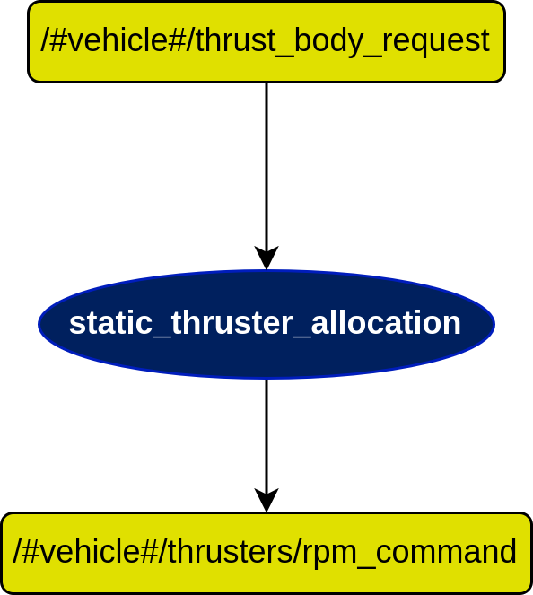
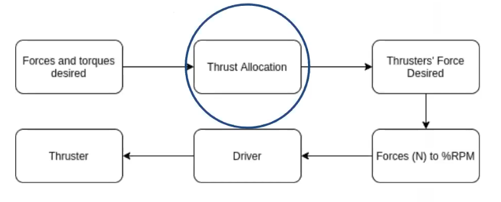
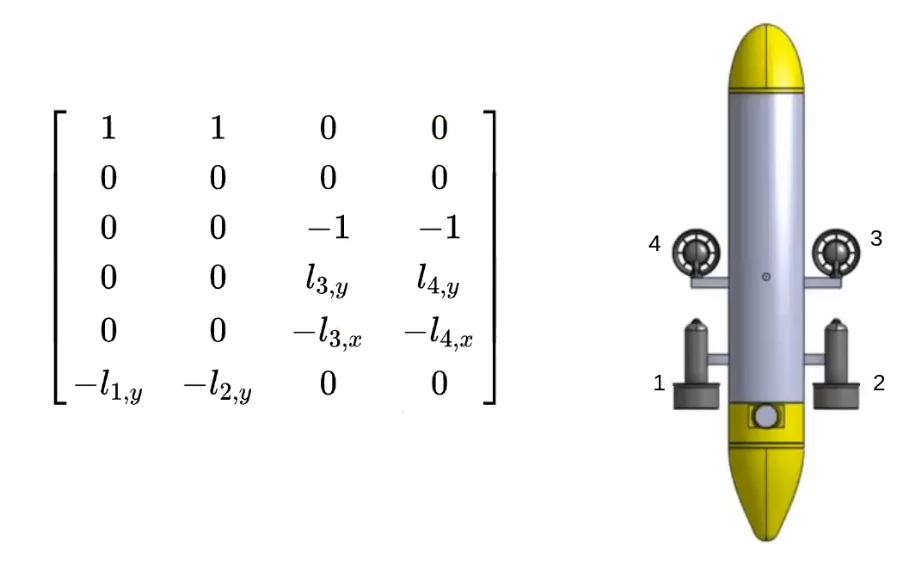
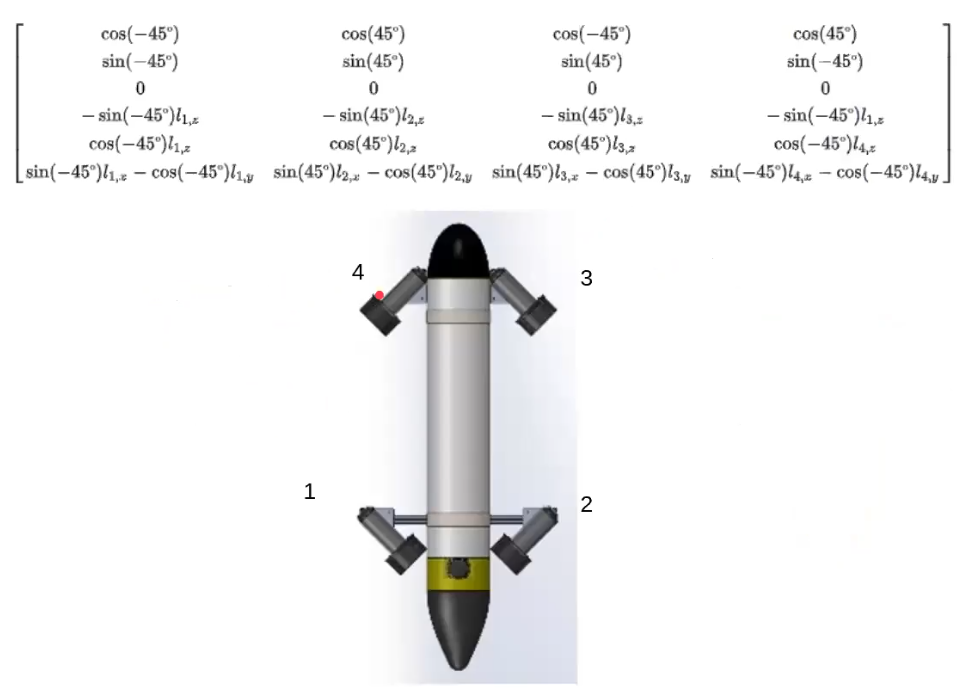

# static_thruster_allocation node

## In a nutshell
Transforms the forces and torques of the inner loops controllers into percentage of RPM(revolution per minute).

## Diagram

## Subscribers

## Publishers

## Services

## Parameters

## Rationale

### Steps

1. **Forces and torques desired:** Given by the inner loops.
2. **Thrust allocation:**  Transforms the forces and torques that we want apply to the vehicle into the necessary forces to give to each thruster.
3.  **Thruster's Force Desired:** Force applied to each thruster.
4. **Forces (N) to %RPM:** Converts the forces into a percentage of RPMs (Revolution per minute). NOTE: can be modified.
5. **Driver:** Computes the signal to send to the thruster ESC (Electronic speed controller).
6. **Thruster:** The thruster ESC reads the signal and converts to to PWMs (Pulse with modulation).

### Thruster Allocation Matrix (TAM)

$r$ - distance to the thruster in $x$, $y$ and $z$ axis. 

### Normal Medusa thruster installation

### Medusa Vector thruster installation

### Computation of force allocation

#### Explicit solution using Lagrange multipliers

![lagrange_multipliers](img/con
