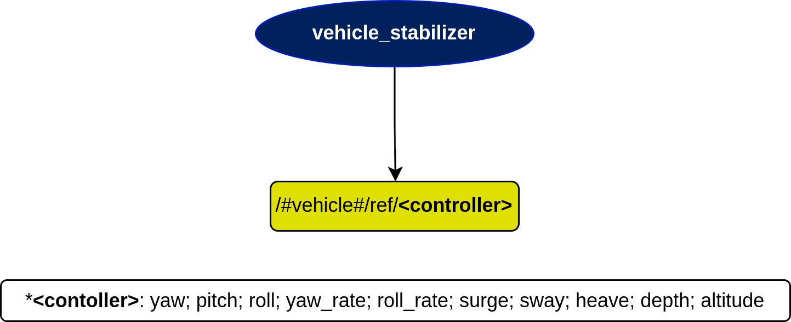

# vehicle_stabilizer Node

## In a nutshell
This node outputs the desired references for the vehicle to stabilize on, so it maintains the right orientation for its missions.

## Diagram

## Subscribers
* None

## Publishers
| Publishers | msg type | Purpose |
| --- | --- | --- |
| /#vehicle#/ref/`<controller>` | [std\_msgs/Float64](http://docs.ros.org/en/melodic/api/std_msgs/html/msg/Float64.html) | Desired references to make the vehicle stable |

## Services
* None

## Parameters
| Parameters | type | Default | Purpose |
| --- | --- | --- | --- |
| references | dictionary | `{'roll': 0.0, 'pitch': 0.0}` | Dictionary containing the desired references to stabilize the vehicle. It is ready to follow the references for yaw, pitch, roll, yaw_rate, pitch_rate, roll_rate, surge, sway, heave, depth and altitude. Just add the right key and corresponding value to the dictionary. If you want to add new references, you need to reprogram the system |