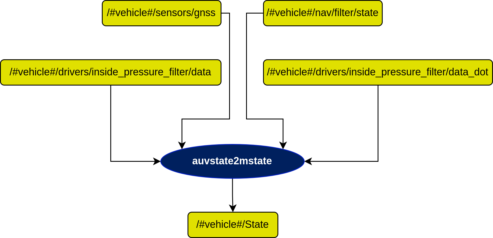

# AuvState2mState Node

## In a nutshell
This node converts state in auv_msgs::NavigationStatus to state in farol_msgs::mState. Also need inside_pressure data for mState.

## Diagram

## Subscribers

## Publishers

## Servers

## Parameters

## Rationale

## Requirements
