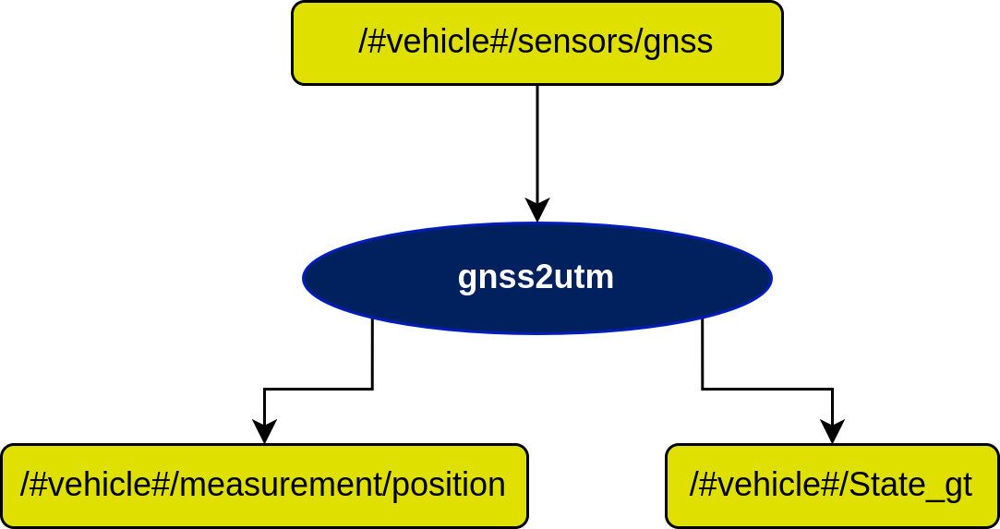

# Gnss2Utm Node

## In a nutshell
This node converts data in WGS84 from sensor_msgs::NavSatFix to UTM NED farol_msgs::Measurement format.

## Diagram

## Subscribers

## Publishers

## Servers

## Parameters

## Rationale

## Requirements

