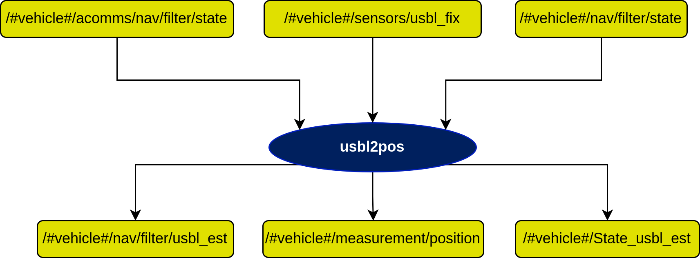

# usbl2pos Node

## In a nutshell
This node takes in georeferences usbl position fix and converts it to position updates of the filter. It can be deployed in two ways

**Scenario 1: Inverted-USBL** In this scenario, the underwater vehicle localizes itself with respect to an anchor, whose precise global position is known. The usbl onboard the vehicle receives the georeferenced position of the anchor and the usbl-fix. The vehicle uses these two information to estimate its position using simple geometry.

**Scenario 2: Tracking with USBL** In this scenario, the anchor, whose precise global position is known, tracks underwater vehicles using USBL fixes. The anchor receives the usbl-fix of the underwater vehicle and uses its own position to estimate the position of the underwater vehicle.

## Diagram

## Subscribers

## Publishers

## Servers

## Parameters

