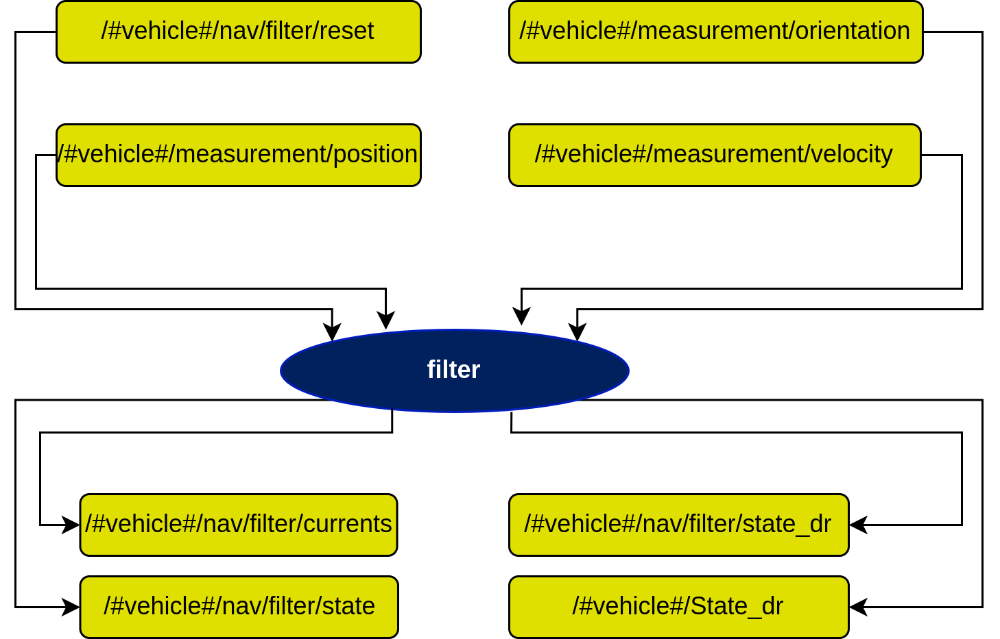

# filter Node

## In a nutshell
A general-purpose kalman filter for vehicle state estimation. For indepth documentation, refer the links below:

* [Theory](./theory.md)
* [Developer Notes](./developer_notes.md)

## Diagram


## Subscribers
| Subscribers                       | msgs type                                                                 | Purpose                                             |
| -----------                       | --------------                                                             | ---------                                           |
| /#vehicle#/Flag                    | [std\_msgs/Int8](http://docs.ros.org/en/api/std_msgs/html/msg/Int8.html) | Farol stack state machine (waypoint, idle, path following, etc.) |
| /#vehicle#/measurement/orientation | [dsor\_msgs/Measurement](https://github.com/dsor-isr/dsor_utils/blob/main/dsor_msgs/msg/Measurement.msg) | Sensor measurement of vehicle orientation |
| /#vehicle#/measurement/position    | [dsor\_msgs/Measurement](https://github.com/dsor-isr/dsor_utils/blob/main/dsor_msgs/msg/Measurement.msg) | Sensor measurement of vehicle position |
| /#vehicle#/measurement/velocity    | [dsor\_msgs/Measurement](https://github.com/dsor-isr/dsor_utils/blob/main/dsor_msgs/msg/Measurement.msg) | Sensor measurement of vehicle velocity along body-frame |
| /#vehicle#/nav/filter/reset        | [std\_msgs/Empty](http://docs.ros.org/en/api/std_msgs/html/msg/Empty.html) | Empty messages sent to reset the navigation filter |
| /#vehicle#/nav/filter/state        | [auv\_msgs/NavigationStatus](https://github.com/oceansystemslab/auv_msgs/blob/1faaddd7ee6e9c2c9869e3d8dcff92bb56c2fce4/msg/NavigationStatus.msg) | Filtered state of the vehicle |
| /tf                               | [tf2\_msgs/TFMessage](http://docs.ros.org/en/api/tf2_msgs/html/msg/TFMessage.html) | Transform ROS message to switch between reference frames (rotations) |
| /tf\_static                       | [tf2\_msgs/TFMessage](http://docs.ros.org/en/api/tf2_msgs/html/msg/TFMessage.html) | Static reference frame |

## Publishers
| Publishers                     | msgs type                            | Purpose                                                      |
| -----------                    | --------------                       | ---------                                                    |
| /#vehicle#/State\_dr            | [farol\_msgs/mState](https://github.com/dsor-isr/farol/blob/main/farol_msgs/msg/mState.msg) | Vehicle state determined using dead reckoning (sensors other than GPS and USBL, such as DVL, IMU, etc.) in message form to send to the console |
| /#vehicle#/nav/filter/currents  | [farol\_msgs/Currents](https://github.com/dsor-isr/farol/blob/main/farol_msgs/msg/Currents.msg) | Current estimation |
| /#vehicle#/nav/filter/state     | [auv\_msgs/NavigationStatus](https://github.com/oceansystemslab/auv_msgs/blob/1faaddd7ee6e9c2c9869e3d8dcff92bb56c2fce4/msg/NavigationStatus.msg) | Filtered state of the vehicle |
| /#vehicle#/nav/filter/state\_dr | [auv\_msgs/NavigationStatus](https://github.com/oceansystemslab/auv_msgs/blob/1faaddd7ee6e9c2c9869e3d8dcff92bb56c2fce4/msg/NavigationStatus.msg) | Vehicle state determined using dead reckoning (sensors other than GPS and USBL, such as DVL, IMU, etc.) |
| /tf                            | [tf2\_msgs/TFMessage](http://docs.ros.org/en/api/tf2_msgs/html/msg/TFMessage.html) | Transform ROS message to switch between reference frames (rotations) |

## Services
| Services                         | msgs type                                                                      | Purpose                                     |
| -----------                      | --------------                                                                 | ---------                                   |
| /#vehicle#/nav/reset\_filter\_dr | [std\_srvs/Trigger](http://docs.ros.org/en/api/std_srvs/html/srv/Trigger.html) | Service to reset dead reckoning filter estimation |

## Parameters

All the parameters are under the namespace of this node (/#vehicle#/nav/filter/), so we will refrain from repeating it for each parameter. Visit the [`nav.yaml`](https://github.com/dsor-isr/farol/blob/main/farol_bringup/config/defaults/mvector/nav.yaml) config file for each vehicle to check these parameters.

| Parameters                                                              | type   | Default     | Purpose                       |
| -----------                                                             | ----   | ----------  | ---------                     |
| /dvl/body\_frame                                   | bool   | true        | Option to incorporate body frame definition for DVL sensor. Set `false` for inertial measurements, or `true` for body measurements |
| /kalman\_filter/bypass\_ahrs                       | bool   | true       | Option to bypass AHRS measurements. Set `true` to consider the AHRS as an input of the filter, or `false` to consider it as a sensor |
| /kalman\_filter/manually\_initialization/frame\_id | string | ""   | Option on how to initialize the navigation filter (if you use the default value, the system will initialize manually) <br /> See **Note1** below |
| /kalman\_filter/manually\_initialization/noise     | array  | [1.0, 1.0, 0.01, 0.001, 0.001, 0.01, 0.02, 0.03, 0.04, 0.01, 0.01, 0.01, 0.0, 0.0, 0.01] | Noise considered in case of a manual initialization (should be a vector with the same size as the state) <br /> See **Note1** below |
| /kalman\_filter/manually\_initialization/value     | array  | [4290822.198309483, 491906.60293571133, 0.0, 0.0, 0.0, 0.0, 0.0, 0.0, 0.0, 0.0, 0.0, 0.0, 0.0, 0.0, 0.0] | Initial values for the filter state (sgould be a vector of the same size as the filter state) <br /> See **Note1** below |
| /kalman\_filter/predict\_period                    | float  | 0.1 | Time period between predictions |
| /kalman\_filter/process\_covariance                | array  | [1.0, 0.1, 0.1, 0.1, 0.1, 0.1] | Process noise covariance regarding the prediction stage of the filters (order: position, velocity, angles, angle\_rate, acceleration, altitude) |
| /kalman\_filter/reset\_period                      | int    | 0 | Reset the filter if no measurement is received for a certain period (any measurement) (0 for no reset) |
| /kalman\_filter/save\_measurement\_interval        | int    | 5 | Buffer for saving measurements while USBL fix is not received |
| /kalman\_filter/sensors                            | -      | See **Note2** below | Sensor configurations for navigation deployment (see `nav.yaml` for more details) |
| /name\_vehicle\_id                                 | string | /#vehicle#/ | Vehicle name (type) and ID |
| /node\_frequency                                   | float  | 10 | Working frequency of node |
| /originLat                                         | float  | 38.765852 | Origin Latitude for inertial frame (EXPO Lisbon site position) |
| /originLon                                         | float  | -9.09281873 | Origin Longitude for inertial frame (EXPO Lisbon site position) |
| /tf/broadcast                                      | bool   | true | Flag to publish transform to rotate frames |
| /tf/frames/base\_link                              | string | base\_link | Type of frame |
| /tf/frames/map                                     | string | map | Type of map for world that is being loaded |
| /tf/frames/odom                                    | string | null | Odometry related parameter |
| /tf/frames/world                                   | string | map | Type of world that is being loaded |

## **Note1:**
To initialize manually, you neeed to define the following parameters:

```yaml
manually_initialization:
    frame_id: "<frame_id>"
    value: <value_vector>
    noise: <noise_vector>
```
* `<frame_id>` is the option on how to initialize the navigation filter. These are the general options:

| Value | Purpose |
| ----- | ------- |
| ""    | Initialize with manual configurations |
| "null" | Initialize with manual configurations |
| "\<sensor\>" | Initialize with the first measurement from the specified sensor <br /> **(1)** \<sensor> keyword must be replaced with an available sensor (see **Note2**) <br /> **(2)** it is common to initialize the filter with the first "gnss" measurements |
| 

* `<value_vector>` is the starting state vector for the filter. It should be in the form of the following vector:

```yaml
[x,              y,              z,
 Vx,             Vy,             Vz,
 roll,           pitch,          yaw,
 roll_rate,      pitch_rate,     yaw_rate,
 acceleration_x, acceleration_y, altitude ]
```

* `<noise_vector>` is the noise used for the prediction stage of the filter. It should be in the form of the following vector:

```yaml
[noise_x,              noise_y,              noise_z,
 noise_Vx,             noise_Vy,             noise_Vz,
 noise_roll,           noise_pitch,          noise_yaw,
 noise_roll_rate,      noise_pitch_rate,     noise_yaw_rate,
 noise_acceleration_x, noise_acceleration_y, noise_altitude ]
```

## **Note2:** 
Adding sensors (dummy) to the filter must have this format:

```yaml
sensors:
    -   frame_id:   "<name>"
        config:     "<type>"
        noise:      <noise_vector>
        outlier_tolerance: <out_tol_num>
        reject_counter: <rej_cou_num>
```

where:

* `<name>` should be defined according to the `<frame_id>` value published directly by the sensor which you want to add to the filter;
* `<type>` options are:

| type         | Measurements |
| ------       | -------   |
| Hposition    | x, y (in utm) |
| Vposition    | z (depth) |
| Hvelocity    | Vx, Vy (inertial frame) |
| Vvelocity    | Vz (inertial frame) |
| orientation  | roll, pitch, yaw, roll\_rate, pitch\_rate, yaw\_rate |
| acceleration | Future work... |
| altitude     | altitude |

* `<noise_vector>` is the matrix with the noise covariance. If you want to use the noise directly from the sensor, fill the noise with zeros. Otherwise, the options are:

| type         | Noise |
| ------       | -------   |
| Hposition    | [noise\_x, noise\_y] |
| Vposition    | [noise\_z] |
| Hvelocity    | [noise\_Vx, noise\_Vy] |
| Vvelocity    | [noise\_Vz] |
| orientation  | [noise\_roll, noise\_pitch, noise\_yaw, <br /> noise\_roll\_rate, noise\_pitch\_rate, noise\_yaw\_rate] |
| acceleration | Future work... |
| altitude     | [noise\_altitude] |

* `<out_tol_num>` should be a float value defined taking into account the precision of the sensors' measurements. A bubble with radius of `<out_tol_num>` will be created around the filtered value. Measurement values outside this bubble are considered as outliers and thus cast aside.

* `<rej_cou_num>` should be an integer value definedtaking into account the precision and the frequency of the sensors' measurements. The consecutive outliers are counted and when they reach the rejection number, they are considered true values. The filter will take in this new value.

* `<outlier_increase>` should be a float value. It consists on the increase of the outlier tolerance as time goes by (`<out_tol_num> + dt * <outlier_increase>`). This is specifically useful in the case of low frequency sensors, like USBL for example. Whenever you receive a measurement from these sensors, the bubble should reset to the original tolerance value `<out_tol_num>`. If not specified should be considered 0.0.

### **Example1:**

Consider a *dummy1* sensor which gives horizontal position (x, y in the inertial frame), at a high frequency and with precision. In order to add this sensor to the filter you should insert these configurations:

```yaml
sensors:
    -   frame_id:   "dummy1"
        config:     "Hposition"
        noise:      [0.001, 0.001]
        outlier_tolerance: 0.2          # inliers should be inside a bubble of 20cm
        reject_counter: 8
```

### **Example2:**

Consider a *dummy2* sensor which gives horizontal velocity (Vx, Vy in the inertial frame), at a high frequency and with low precision. In order to add this sensor to the filter you should insert these configurations:

```yaml
sensors:
    -   frame_id:   "dummy2"
        config:     "Hvelocity"
        noise:      [0.0225, 0.0225]
        outlier_tolerance: 0.2          # inliers should be inside a bubble of 0.2 m/s
        reject_counter: 200   
```

## **Note3:**

If you want to "remove" a sensor from being considered in the filter, take this specific case:

Contemplate a sensor that publishes a message with "dummy" in the `<frame_id>`. To be accepted as a sensor, you must have in the `nav.yaml`the following code:

```yaml
sensors:
    -   frame_id:   "dummy"
        config:     "<type>"
        noise:      <noise_vector>
        outlier_tolerance: <out_tol_num>
        reject_counter: <rej_cou_num>
```

If you want to take out this sensor from the filter, **you need to change the `<frame_id>` to a random name, one that the filter code does not recognize.**