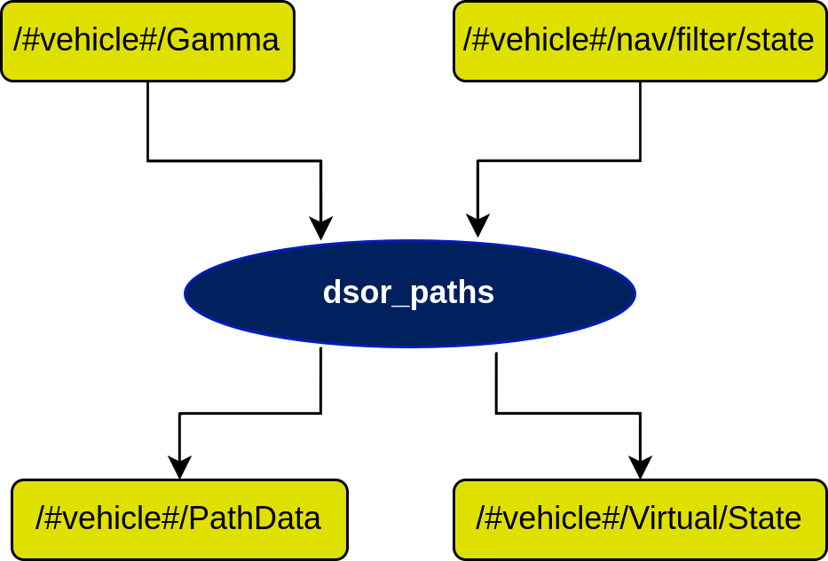

# dsor_paths Node
This node deals with the rationale previously explained in the *dsor\_paths* documentation. It manages and deploys paths for the vehicles to follow.

## Diagram

## Subscribers
| Subscribers                 | msgs type                                                                            | Purpose                                                                           |
| -----------                 | --------------                                                                       | ---------                                                                         |
| /#vehicle#/Gamma            | [std\_msgs/Float64](http://docs.ros.org/en/api/std_msgs/html/msg/Float64.html)       | The coordination state of a certain vehicle with respect to others on the network |
| /#vehicle#/nav/filter/state | [auv\_msgs/NavigationStatus](https://github.com/oceansystemslab/auv_msgs)            | The navigation state of the vehicle after filtering                               |

## Publishers
| Publishers               | msgs type                                                                         | Purpose                                                                            |
| -----------              | --------------                                                                    | ---------                                                                          |
| /#vehicle#/PathData      | [dsor\_paths/PathData](PathData.md)                                               | Message with the path data on a certain point (curvature, tangent, velocity, etc.) |
| /#vehicle#/Virtual/State | [farol\_msgs/mState](https://dsor-isr.github.io/farol/farol-ros-messages/mState/) | Vehicle state message                                                              |

## Services
| Services                      | msgs type                                       | Purpose                                                                  |
| -----------                   | --------------                                  | ---------                                                                |
| /#vehicle#/ResetPath          | [dsor\_paths/ResetPath](ResetPath.md)           | Reset the current assigned path                                          |
| /#vehicle#/SetConstVdRabbit   | [dsor\_paths/SetConstSpeed](SetConstSpeed.md)   | Set a constant speed for the rabbit which a certain vehicle is following |
| /#vehicle#/SetConstVdVehicle  | [dsor\_paths/SetConstSpeed](SetConstSpeed.md)   | Set a constant speed for the vehicle itself                              |
| /#vehicle#/SetMode            | [dsor\_paths/SetMode](SetMode.md)               | Set a certain mode of operation                                          |
| /#vehicle#/SpawnArc2DPath     | [dsor\_paths/SpawnArc2D](SpawnArc2D.md)         | Create a 2D circumference arc path                                       |
| /#vehicle#/SpawnBernoulliPath | [dsor\_paths/SpawnBernoulli](SpawnBernoulli.md) | Create a Bernoulli path                                                  |
| /#vehicle#/SpawnCircle2DPath  | [dsor\_paths/SpawnCircle2D](SpawnCircle2D.md)   | Create a 2D Circle path                                                  |
| /#vehicle#/SpawnLineDPath     | [dsor\_paths/SpawnLine](SpawnLine.md)           | Create a Line path                                                       |

## Parameters
| Parameters                 | type   | Default     | Purpose                       |
| -----------                | ----   | ----------  | ---------                     |
| /#vehicle#/frame\_id       | string | Path\_frame | ID assigned to the path frame |
| /#vehicle#/node\_frequency | float  | 10.0        | Working frequency of the node |
