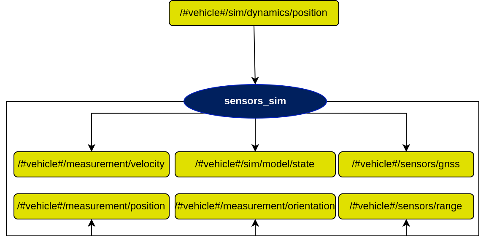

# Sensor Sim package

## In a nutshell

This package implements basic sensor models for an underwater/surface vehicles. It has the following features - Simulate GPS, Depth, DVL (Bottom Track and Water Track), Altitude, AHRS, Ranges - Control Gaussian Noise and Measurement Noise - Control Sensor Publish Frequency - Publish State output of the dynamic model in *auv_msgs::NavigationStatus* format

## Diagram


## Subscribers

## Publishers

## Services

## Parameters

## Package content

## Rationale
### Getting Started

#### Installation

Pkg `sensor_sim` comes as part of the farol stack.

#### Configuration

This section explains how to write the node configuration file. Sample are given below

```
topics:
  subscribers: [ "/dynamics_sim/position"]
  publishers : [
    "/measurement/position",
    "/measurement/velocity",
    "/measurement/orientation",
    "/sensors/gnss",
    "/sensors/range",
    "/sim/dynamics/model",
    "/diagnostics/thrusterStatus"
  ]
water_column: 100
sensors:
  - type     : "GNSS"
    frame_id : "gnss"
    frequency: 1.0
    count    : 500
    noise    : 0.0
    variance : 0.03
    debug    : false
  - type     : "DVL_BT"
    frame_id : "dvl_bt"
    frequency: 5.0
    noise    : 0.015
    variance : 0.001
    altitude : 30.0
    debug    : true
  - type     : "DVL_WT"
    frame_id : "dvl_wt"
    frequency: 5.0
    noise    : 0.01
    variance : 0.0
    altitude : 110.0
  - type     : "AHRS"
    frame_id : "ahrs"
    frequency: 10.0
    noise    : [0, 0]
    variance : 0.000001
  - type     : "DEPTH"
    frame_id : "depth"
    frequency: 10.0
    noise    : 0.01
    variance : 0.005
  - type     : "ALTIMETER"
    frame_id : "altimeter"
    frequency: 5.0
    noise    : 0.1
    variance : 0.1
  - type     : "MODEL"
    frequency: 10.0
```

1. topics/publishers: parameter of type *string[7]*

   - Defines the output topics - [position, velocity, orientation, gnss, range, model, thruster]
- position topic is used to publish DEPTH & ALTIMETER measurements of type *farol_msgs::Measurement*
   - velocity topic is used to publish DVL_BT, DVL_WT measurements of type *farol_msgs::Measurement*
- orientation topic is used to publish AHRS measurements of type *farol_msgs::Measurement*
   - gnss topic is used for GNSS measurements in WGS84 of type *sensor_msgs::NavSatFix*
- range topic is used for single beacon measurements of type *farol_msgs::mUSBLFix*
   
2. topics/subscribers: parameter of type *string[1]*

   - position topic to receive the dynamic state of the vehicle in *nav_msgs::Odometry*

3. **water_column**: Length of water column (We assume that water column is constant)

**sensors**: Sensors to be simulated are described as a list of type . Any number of sensors may be defined following the format described below.

1. type: parameter of type *string*

   - Defines the type of sensor to be simulated. Current available sensors are "GNSS", "DVL_WT", "DVL_BT", "AHRS", "DEPTH", "ALTIMETER", "RANGE", "MODEL"

2. frame_id: parameter of type *string*

   - Frame id of the simulated sensor, must be unique

3. frequency: parameter of type *double*

   - Controls how often the sensor publishes data

4. count: parameter of type *int*

   - Sensor stops publishing after this many outputs
- Put 0 for infinite
   
5. noise: parameter of type *double*

   - gaussian noise added to the sensor

6. variance: parameter of type *double*

   - In addition to the gaussian noise, a constant value is added while publishing the sensor value and variance.
- Its main purpose is to easily tune the measurement noise being fed to the filter
   - This value has no effect while adding noise to the sensor!

## Requirements
